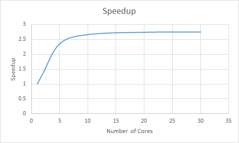
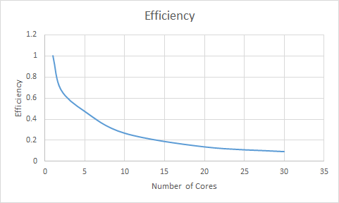

# PROJECT REPORT BY DIPEN CHAUHAN

## Objectives
- Implement a parallel version of Gaussian elimination with partial pivoting.
- Run timing tests and analyze speedup and efficiency.

# Pseudocode Showing Key Elements In The Parallelization Strategy

	for i=0...n-2

		// Pivoting:
		find p > i such that |a[p][i]| > |a[j][i]| for j > i
		Switch a[p] with a[i]

		// Make the diagonal element of the matrix of this row = 1
		Row a[i] = Row a[i] / diagonalElement

		// Annihilation: 
		// Zero all the elements in the column below the diagonal element
		// Divide iterations of the for loop among threads
		for j=i+1...n-1 // For each row below i
			if (a[j][i] ≠ 0)
				Row a[j] = Row a[j] - factor * Row a[i]
			end
		end
	end

	// Make the diagonal element of the last row 1
	Row a[n-1] = Row a[n-1] / diagonalElement

	Back Substitution:

	for i=n-1..0
		sub = a[i][n-1]

		// Back substitute sub in all rows above i
		// This work can be divided among threads or parallelized.
		// Depending on the number of the threads, 
		// each thread either gets no rows or complete row(s)
		for j=0..i-1
			a[j][n] = a[j][n] - sub * a[j][i];
		end

	end

# Data Storage

Gaussian elimination is a method for solving matrix equations of the form
Ax = b where A is a Matrix, and x and b are vectors.

I used an array of pointers to an array of doubles to represent the augmented matrix. For example if the matrix size was 4, my program would have an array of 4 points each to an array of 5 doubles. 

To calculate the I2 norm, I had to store matrix A separately as an array of pointers to an array of doubles, the solution x as an array of doubles and b also as an array of doubles.

I chose to store my matrix as an array of pointers to an array of doubles because it would be easy to swap rows during partial pivoting. All we have to do is interchange the addresses the pointers are pointing to.

# Exploiting Parallelism and Partitioning Data & Work

Parallelization was used in 2 sections of my code:

1) Annihilation - During each iteration of the annihilation process, the rows are divided among threads that subtract the row containing the pivot element from the row they are assigned. The number of rows needed to be computed is reduced by one after each iteration.
2) Back Substitution - During each iteration the rows are divided among threads. Each thread back substitutes with one variable during each iteration. The number of rows needed to be computed is reduced by one after each iteration.

# Synchronization

Synchronization happens (all the threads join) automatically at the end of the block following my a #pragma omp parallel statements.

# Justification for Implementation Choices

As mentioned earlier, I chose to store my matrix as an array of pointers to an array of doubles because it would be easy to swap rows during partial pivoting. All we have to do is interchange the addresses the pointers are pointing to. Parallelization was done in Annihilation and Back Substitution. The performance benifit in parallelizing Back Substitution might be questionable as only one statement gets executed by each thread in the parallel section. Performance benifit was not observed when parallelizing random generation of the matrix so its implementation was removed and done serially instead.

# Timings

Problem size n = 8000 was used to evaluate the performance of my implementation. Timing measurements for the combination of the elimination and back substitution phases of my implementation were collected.

| # Cores | Time (s)           |||||
|------:|------------|------------|------------|------------|------------|
| 1     | 570.318198 | **570.140426** | 642.862851 | 648.233734 | 648.171710 |
| 2     | 420.283759 | 421.882246 | 431.313673 | 432.813073 | **419.426101** |
| 5     | 248.244881 | 247.548421 | **241.307507** | 242.004513 | 241.986887 |
| 10    | 213.984610 | **213.856487** | 225.228781 | 224.865838 | 410.658996 |
| 20    | 410.105860 | **207.847415** | 208.121708 | 207.960084 | 207.947326 |
| 30    | **207.122235** | 410.145916 | 207.129673 | 219.694855 | 410.346868 |

# Speedup and Efficiency

Table of Speedup and Efficiency calculated from the minimums

| # Cores | Time       | Speedup     | Efficiency  | 
|--------:|------------|-------------|-------------| 
| 1       | 570.140426 | 1.000000000 | 1.000000000 | 
| 2       | 419.426101 | 1.359334635 | 0.679667318 | 
| 5       | 241.307507 | 2.362713175 | 0.472542635 | 
| 10      | 213.856487 | 2.665995472 | 0.266599547 | 
| 20      | 207.847415 | 2.743072008 | 0.137153600 | 
| 30      | 207.122235 | 2.752676100 | 0.091755870 | 

Graph of Speedup

Graph of Efficiency

